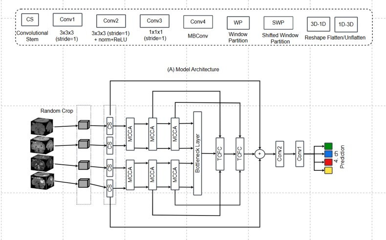
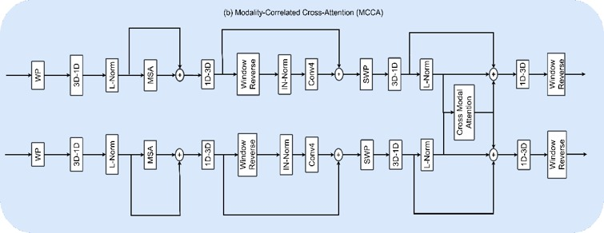
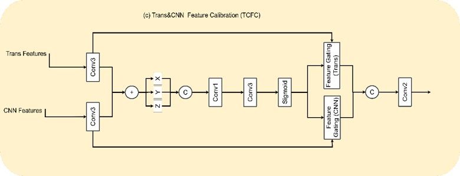

# Efficient-CKD-TransBTS

> **Efficient CKD-TransBTS for 3D Glioma Segmentation through Architecture Adaptation and Taguchi-Based Hyperparameter Optimization**

[](https://www.python.org/)
[](https://pytorch.org/)
[](https://monai.io/)
[](https://colab.research.google.com/)

---

## 📌 Overview

This repository presents an efficient adaptation of **CKD-TransBTS** for 3D multi-modal glioma brain tumor segmentation using the **BraTS-GLI 2024** dataset. 

While the original CKD-TransBTS achieves high accuracy, its computational and memory footprints remain prohibitively heavy for resource-constrained environments. This project optimizes the trade-off between segmentation performance and model efficiency via:
1. **Architectural adaptation** to drastically reduce model parameters and compute demands.
2. **Taguchi experimental design ($L_9$)** for systematic hyperparameter tuning.

> **Note:** The included Google Colab notebook provides the full training and evaluation pipeline for the final, optimal configuration (**L5**), rather than the complete initial $L_1$–$L_9$ exploratory trials.

---

## 🎯 Key Highlights

* **~79× Parameter Reduction:** Model size compressed from **82.28M** down to **1.04M** parameters.
* **~1.67× Faster Inference:** Average inference time decreased from **144.13 s** to **86.18 s**.
* **Competitive Metrics:** Maintained a competitive **0.6989 Mean Dice** (vs. 0.7151 reference), while improving overall Sensitivity (**0.8205**) and HD95 (**5.77 mm**).

---

## 🏗️ Architecture Adaptation

The adapted model retains the core multi-modal feature learning principle of CKD-TransBTS while streamlining resource-intensive components to improve parameter efficiency and inference speed.

### Model Overview
<p align="center">
  
</p>

* **Base Channels:** Reduced to a constant **16 channels** across all stages.
* **Bottleneck:** Replaced heavy transformer layers with an efficient convolutional bottleneck.
* **Modality Pairing:** Multi-modal MRI inputs are grouped into two complementary streams:
  * Stream A: `T1c` + `T1n`
  * Stream B: `T2f` + `T2w`

---

### Key Sub-Modules

#### 1. Modality-Correlated Cross-Attention (MCCA)
Three sequential MCCA blocks are utilized (base channel: 32, attention heads: 2) to capture cross-modal dependencies between MRI sequences efficiently.

<p align="center">
  
</p>

#### 2. Transformer & CNN Feature Calibration (TCFC)
Feature calibration is performed to dynamically weigh and integrate representations originating from both convolutional and attention mechanisms before final decoding.

<p align="center">
  
</p>
## 📊 Taguchi Hyperparameter Optimization

A Taguchi $L_9(3^3)$ orthogonal array was employed to systematically screen three critical training factors across three levels:

| Factor | Level 1 | Level 2 | Level 3 |
| :--- | :---: | :---: | :---: |
| **Learning Rate** | 0.001 | 0.0001 | 0.00001 |
| **Optimizer** | Adam | AdamW | SGD |
| **Patch Size** | $128 \times 128 \times 128$ | $96 \times 96 \times 96$ | $64 \times 64 \times 64$ |

### Selected Configuration (L5)
The **L5** configuration yielded the highest validation performance and was selected for full model convergence:

| Configuration | Learning Rate | Optimizer | Patch Size | Mean Dice |
| :---: | :---: | :---: | :---: | :---: |
| **L5** | **0.0001** | **AdamW** | **$64 \times 64 \times 64$** | **0.6553** |

---

## 🧪 Experimental Setup

### Dataset & Subregions
Evaluated on **BraTS-GLI 2024** using a fixed random seed of `42`:
* **Training:** 1,081 cases
* **Validation:** 270 cases
* **Testing:** 270 cases

* **Modalities:** T1n, T1c, T2w, and T2f.
* **Target Subregions:**
  * Primary: Non-enhancing tumor core (**NETC**), Surrounding non-enhancing FLAIR hyperintensity (**SNFH**), Enhancing tumor (**ET**), and Resection cavity (**RC**).
  * Compound: Tumor Core (**TC** = ET + NETC), Whole Tumor (**WT** = ET + NETC + SNFH).

*(Due to BraTS licensing agreements, dataset files are not distributed within this repository. Please obtain access via the CBICA distribution portal).*

### Preprocessing & Augmentation
* **Pipeline:** RAS orientation $\rightarrow$ Resampling to $1 \times 1 \times 1\text{ mm}$ $\rightarrow$ $1^{\text{st}}$–$99^{\text{th}}$ percentile intensity clipping $\rightarrow$ Foreground cropping $\rightarrow$ Patch extraction ($64 \times 64 \times 64$).
* **Augmentations:** Random flips, $90^\circ$ rotations, affine transforms, 3D elastic deformation, zoom, and Gaussian noise.

### Training Configuration
* **Optimizer:** AdamW (LR: `1e-4`, Weight Decay: `1e-5`)
* **Scheduler:** CosineAnnealingLR (minimum LR: `1e-5`)
* **Loss Function:** Combined Cross-Entropy + Generalized Dice Loss
* **Efficiency Features:** Automatic Mixed Precision (AMP), Gradient Accumulation, and Gradient Clipping over 100 epochs.

---

## 📈 Results & Evaluation

### 1. Overall Performance vs. Reference

| Metric | Optimized CKD-TransBTS | Reference Model | Change |
| :--- | :---: | :---: | :---: |
| **Parameters** | **1.04M** | 82.28M | **-98.7% (~79× smaller)** |
| **Mean Dice** | 0.6989 | 0.7151 | -0.0162 |
| **Sensitivity** | **0.8205** | 0.8058 | **+0.0147** |
| **HD95** | **5.77 mm** | 6.32 mm | **-0.55 mm (better)** |
| **Avg. Inference Time** | **86.18 s** | 144.13 s | **~1.67× faster** |

### 2. Dice Score by Subregion

| Subregion | Dice Score |
| :--- | :---: |
| Whole Tumor (WT) | **0.8598** |
| Surrounding FLAIR Hyperintensity (SNFH) | **0.8443** |
| Non-enhancing Tumor Core (NETC) | **0.7117** |
| Resection Cavity (RC) | 0.6080 |
| Tumor Core (TC) | 0.5849 |
| Enhancing Tumor (ET) | 0.5846 |

### 3. Inference Latency Benchmark

| Test Case | Optimized Model | Reference Model |
| :--- | :---: | :---: |
| Case 1 (Anton) | 86.09 s | 167.31 s |
| Case 2 (Rudi) | 100.80 s | 107.10 s |
| Case 3 (Siti) | 71.64 s | 157.97 s |
| **Average** | **86.18 s** | **144.13 s** |

---

## ⚠️ Limitations

* **Epoch Constraints:** Training was capped at 100 epochs due to GPU quotas (compared to 261 epochs in the reference literature).
* **Small Region Sensitivity:** Segmentation accuracy for localized regions (ET and RC) remains lower than broader regions (WT and SNFH) due to generic foreground patch sampling.
* **Taguchi Scope:** The Taguchi experiment was applied specifically for hyperparameter identification and did not extend to full S/N ratio or ANOVA factor-significance calculations.

---

## 📚 Citation

If you find this codebase or research useful, please cite:

```bibtex
@thesis{rifandy2026ckdtransbts,
  author = {Zul Tiandra Rifandy},
  title  = {Optimisasi Hyperparameter Model CKD-TransBTS Menggunakan Metode Taguchi untuk Segmentasi Glioma Otak 3D secara Efisien},
  school = {Universitas Esa Unggul},
  year   = {2026}
}
